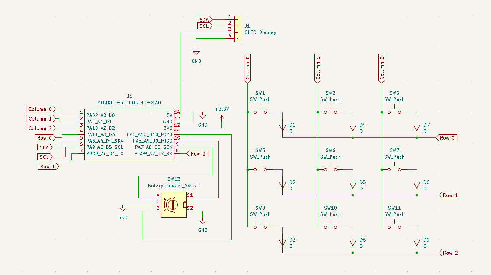
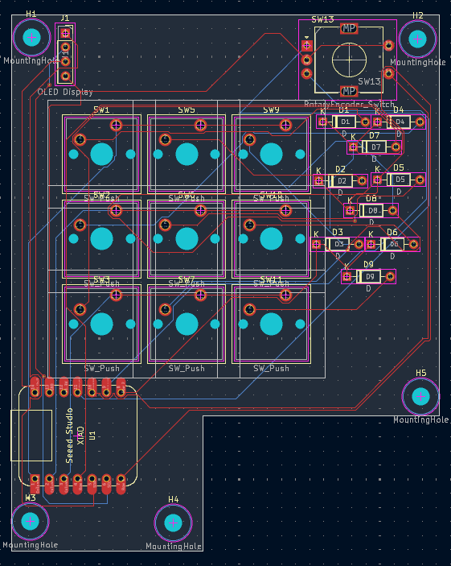
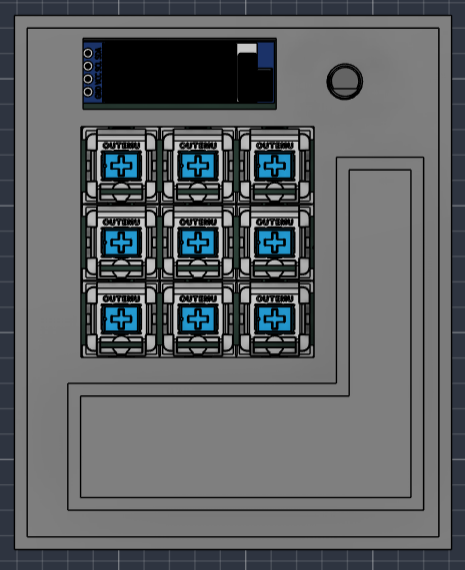
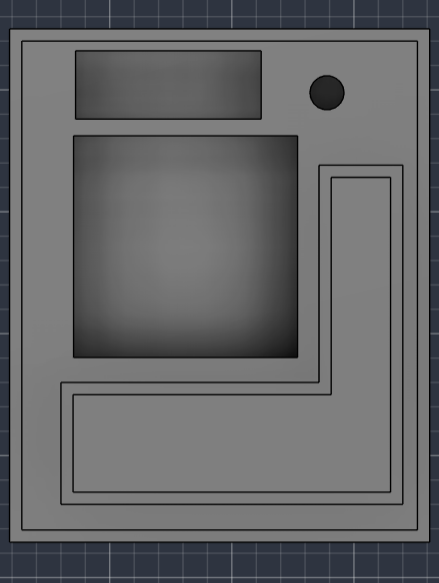
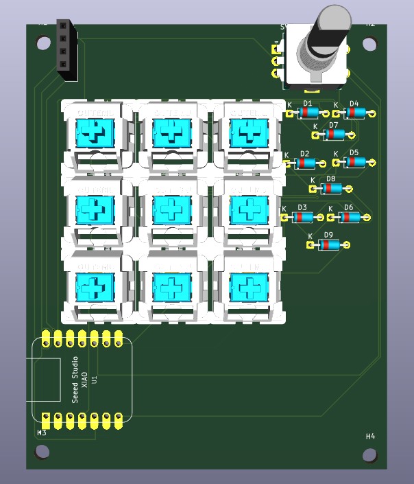

# DreamPad

### A customizable physical control pad for your digital workspace.

**DreamPad by DreamXV** is a custom USB control pad designed to make everyday laptop interactions faster, easier, and more fun.

It combines productivity shortcuts, customizable website shortcuts, volume control, an OLED display, and controls for a virtual character into one compact device.

---

## ✨ Features

- ⌨️ Copy, Cut, and Paste buttons
- 🌐 3 customizable website/application shortcuts
- 🔊 Rotary encoder for laptop volume control
- 🎮 3 buttons for virtual character actions
- 🖥️ OLED display
- 🔌 USB connection to a laptop
- ⚙️ Customizable button actions
- 🧩 Custom PCB
- 🖨️ Custom 3D-printed enclosure

---

## 💡 Inspiration

I wanted to build a small physical device that could sit on my desk and give me quick access to the things I use every day.

Instead of constantly switching between my keyboard, mouse, and different applications, DreamPad puts frequently used actions directly under my fingers.

I also wanted to make it more personal by adding an OLED display and physical controls for a virtual character.

---

## 🧠 How It Works

DreamPad uses a microcontroller to read the buttons and rotary encoder and communicate with the laptop through USB.

```text
Physical Input
      ↓
Microcontroller
      ↓
USB
      ↓
Laptop
      ↓
Software
      ↓
Shortcut / Website / Volume / Character
```

The buttons are arranged as a **3 × 3 matrix**, allowing 9 buttons to be controlled using fewer GPIO pins.

The rotary encoder provides rotational input for volume control and also includes a push switch that can be used as an additional input.

The OLED display communicates with the microcontroller using I²C.

---

## 🔘 Controls

| Control | Function |
|---|---|
| Button 1 | Copy |
| Button 2 | Cut |
| Button 3 | Paste |
| Button 4 | Website Shortcut 1 |
| Button 5 | Website Shortcut 2 |
| Button 6 | Website Shortcut 3 |
| Button 7 | Character Action 1 |
| Button 8 | Character Action 2 |
| Button 9 | Character Action 3 |
| Rotary Encoder | Laptop Volume Control |
| Encoder Press | Additional Action |

### Example Website Shortcuts

```text
Button 4 → YouTube
Button 5 → Hack Club
Button 6 → GitHub
```

The website shortcuts can be changed depending on the user's workflow.

---

# 🔧 Hardware

## Schematic

The schematic contains the complete electrical design for DreamPad, including the 9-key matrix, rotary encoder, OLED display, and Seeed Studio XIAO microcontroller.



---

## PCB

After completing the schematic, I converted the design into a custom PCB layout.

The PCB contains the routing and footprints required for the microcontroller, buttons, rotary encoder, OLED, and other components.



---

## PCB 3D View

The 3D PCB view was used to check component placement and make sure the physical components fit correctly on the board.



---

# 🖨️ CAD Design

The enclosure was designed as a custom 3D-printable case for DreamPad.

The enclosure was designed around the PCB and physical components to make sure everything fits correctly.



---

## CAD + PCB

The PCB and enclosure were combined in CAD to verify the physical fit before manufacturing and assembly.

This helped check the placement of the switches, rotary encoder, PCB, mounting holes, and other components.



---

# 🖥️ OLED Display

DreamPad includes an OLED display connected through I²C.

The OLED can provide feedback such as:

- Current volume
- Active profile
- Button actions
- Character status
- Device information

---

# 🔄 Rotary Encoder

The rotary encoder provides a physical way to control the laptop's volume.

```text
Rotate Clockwise
        ↓
    Volume Up

Rotate Counter-Clockwise
        ↓
    Volume Down

Press Encoder
        ↓
   Custom Action
```

The encoder uses two quadrature signals to determine the direction of rotation.

---

# ⌨️ Key Matrix

DreamPad uses a **3 × 3 key matrix** containing 9 mechanical switches.

```text
        Column 0    Column 1    Column 2

Row 0      ●           ●           ●

Row 1      ●           ●           ●

Row 2      ●           ●           ●
```

Each switch has a diode to help prevent unwanted key interactions and ghosting when multiple keys are pressed.

---

# 💻 Software

The software side of DreamPad handles communication between the physical device and the laptop.

It is responsible for:

- Copy / Cut / Paste shortcuts
- Website shortcuts
- Volume control
- OLED feedback
- Virtual character actions
- Custom button mappings

---

# 🛠️ Build Process

## 1. Schematic

I started by designing the complete electrical schematic and deciding how the buttons, OLED, rotary encoder, and microcontroller would connect.

## 2. PCB Design

After completing the schematic, I created the PCB layout and routed the connections between the components.

## 3. 3D PCB Verification

I added 3D models of the components to check their placement and dimensions.

## 4. CAD Enclosure

I designed a custom enclosure around the completed PCB and components.

## 5. CAD + PCB Verification

I combined the PCB and enclosure models to verify that the components would fit correctly.

## 6. Assembly

The final step was assembling the components and preparing the device for testing.

---

# 📁 Project Structure

```text
DreamPad/
│
├── images/
│   ├── schematic.png
│   ├── pcb.png
│   ├── pcb_3d.png
│   ├── cad.png
│   └── cad_pcb.png
│
├── hardware/
│   ├── schematic/
│   └── pcb/
│
├── cad/
│
├── firmware/
│
├── software/
│
└── README.md
```

---

# 📚 What I Learned

Through DreamPad, I learned more about:

- PCB design
- Electronic schematics
- Key matrices
- Rotary encoders
- I²C communication
- Microcontrollers
- USB HID
- CAD design
- 3D printing
- Hardware and software integration

---

# 🚧 Future Improvements

Some features I would like to explore in future versions:

- More programmable buttons
- OLED animations
- More virtual character interactions
- Multiple profiles
- Custom configuration software
- Wireless connectivity
- RGB lighting

---

# 🏁 Final Result

DreamPad combines hardware and software into a single desktop device that makes everyday computer interactions more accessible while adding a fun and personal interface.

It started as an idea for a simple control pad and developed into a complete custom hardware project.

---

# 👨‍💻 Creator

**DreamPad by DreamXV**

Built by **DreamXV**.
